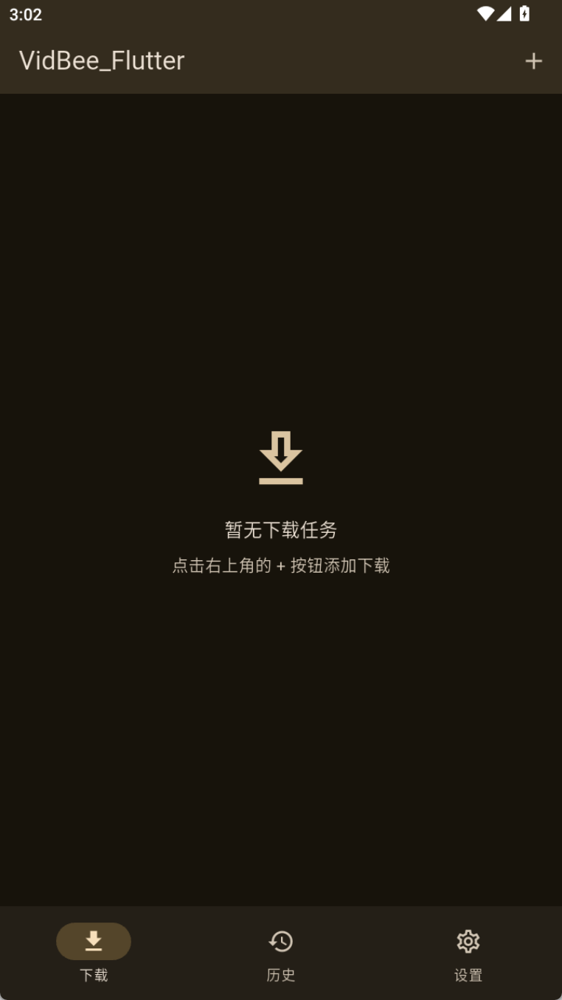
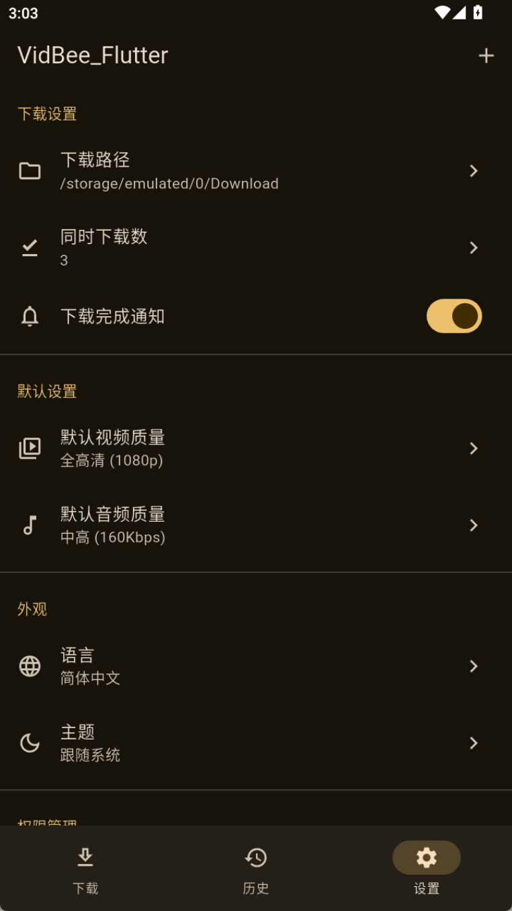
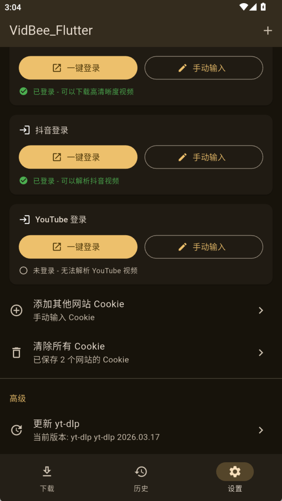
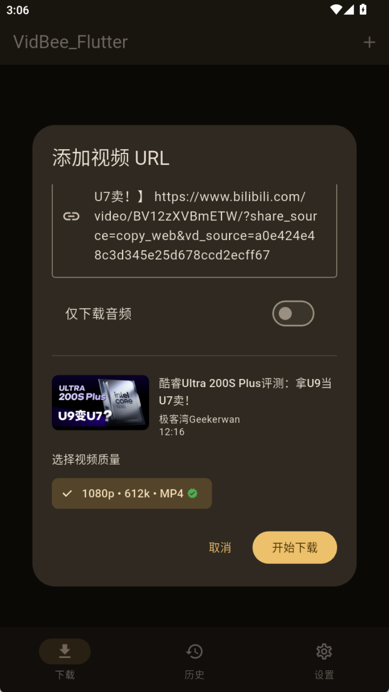

## 📖 English

VidBee_Flutter is a modern, open-source video downloader for Android that lets you download videos and audios from 1000+ websites worldwide. Built with Flutter and powered by yt-dlp, VidBee_Flutter offers a clean, intuitive interface with powerful features for all your downloading needs.

### 👋🏻 Getting Started

VidBee_Flutter is currently under active development, and feedback is welcome for any [issue](https://github.com/Autsunset/VidBee_Flutter/issues) encountered.

[📥 Download VidBee_Flutter](https://github.com/Autsunset/VidBee_Flutter/releases/latest)

#### 📸 Screenshots

| 主页 | 设置 | 设置 | 解析示例 |
|------|------|------|----------|
|  |  |  |  |

> [!IMPORTANT]
>
> **Star Us**, You will receive all release notifications from GitHub without any delay ~

### ✨ Features

#### 🌍 Global Video Download Support

Download videos from almost any website worldwide through the powerful yt-dlp engine. Support for 1000+ sites including YouTube, TikTok, Instagram, Twitter, and many more.

#### 🎨 Best-in-class UI Experience

Modern, clean interface with intuitive operations. Real-time progress tracking and comprehensive download queue management.

#### 🔐 Bilibili One-Click Login

Seamlessly log in to Bilibili using WebView for accessing restricted content.

#### ⚙️ Customizable Settings

- Download path selection
- Video and audio quality settings
- Theme switching (Light/Dark/System)
- Language switching
- Permission management
- Cookie management

### 🌐 Supported Sites

VidBee_Flutter supports 1000+ video and audio platforms through yt-dlp.

### 🛠️ Tech Stack

- **Flutter** - Cross-platform mobile development framework
- **Dart** - Programming language
- **Riverpod** - State management
- **Drift** - Local database (SQLite)
- **extractor** - yt-dlp + FFmpeg integration
- **Material Design 3** - Modern UI design

### 🤝 Contributing

You are welcome to join the open source community to build together.

### 📄 License

This project is distributed under the MIT License.

### 🙏 Thanks

- [yt-dlp](https://github.com/yt-dlp/yt-dlp) - The powerful video downloader engine
- [FFmpeg](https://ffmpeg.org/) - The multimedia framework for video and audio processing
- [Flutter](https://flutter.dev/) - Build beautiful native apps for mobile
- [原 VidBee](https://github.com/nexmoe/VidBee) - The original desktop version that inspired this project

---

## 📖 中文

VidBee_Flutter 是一个现代化的开源 Android 视频下载器，可让您从全球 1000+ 个网站下载视频和音频。基于 Flutter 构建，使用 yt-dlp 作为核心引擎，VidBee_Flutter 提供简洁、直观的界面和强大的下载功能。

### 👋🏻 开始使用

VidBee_Flutter 目前正在积极开发中，欢迎对遇到的任何 [问题](https://github.com/Autsunset/VidBee_Flutter/issues) 提供反馈。

[📥 下载 VidBee_Flutter](https://github.com/Autsunset/VidBee_Flutter/releases/latest)

#### 📸 截图预览

| 主页 | 设置 | 设置 | 解析示例 |
|------|------|------|----------|
|  |  |  |  |

> [!IMPORTANT]
>
> **给我们 Star**，您将第一时间收到所有 GitHub 发布通知 ~

### ✨ 功能特点

#### 🌍 全球视频下载支持

通过强大的 yt-dlp 引擎从全球几乎任何网站下载视频。支持 1000+ 网站，包括 YouTube、TikTok、Instagram、Twitter 等。

#### 🎨 一流的用户体验

现代化、简洁的界面，操作直观。实时进度跟踪和完善的下载队列管理。

#### 🔐 Bilibili 一键登录

使用 WebView 无缝登录 Bilibili，访问受限内容。

#### ⚙️ 可自定义设置

- 下载路径选择
- 视频和音频质量设置
- 主题切换（亮色/暗色/跟随系统）
- 语言切换
- 权限管理
- Cookie 管理

### 🌐 支持的网站

VidBee_Flutter 通过 yt-dlp 支持 1000+ 视频和音频平台。

### 🛠️ 技术栈

- **Flutter** - 跨平台移动开发框架
- **Dart** - 编程语言
- **Riverpod** - 状态管理
- **Drift** - 本地数据库（SQLite）
- **extractor** - yt-dlp + FFmpeg 集成
- **Material Design 3** - 现代 UI 设计

### 🤝 贡献

欢迎加入开源社区一起构建。

### 📄 许可证

本项目采用 MIT 许可证分发。

### 🙏 致谢

- [yt-dlp](https://github.com/yt-dlp/yt-dlp) - 强大的视频下载引擎
- [FFmpeg](https://ffmpeg.org/) - 视频和音频处理的多媒体框架
- [Flutter](https://flutter.dev/) - 构建精美的原生移动应用
- [原 VidBee](https://github.com/nexmoe/VidBee) - 启发本项目的原始桌面版本
