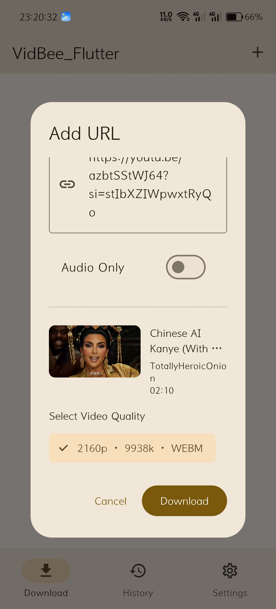
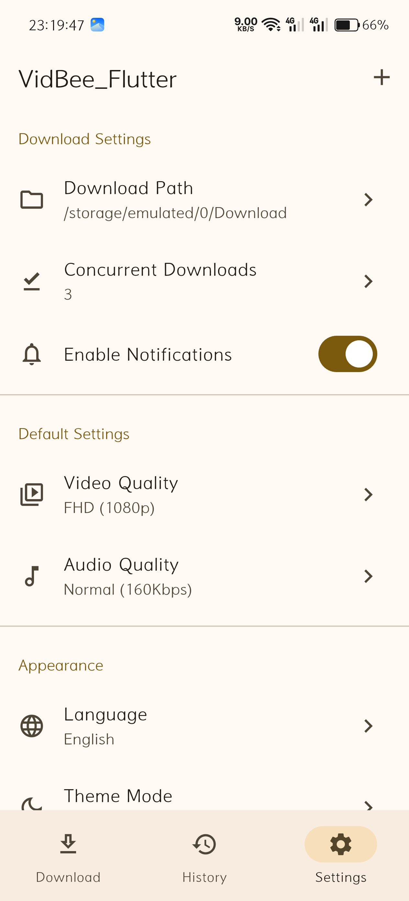
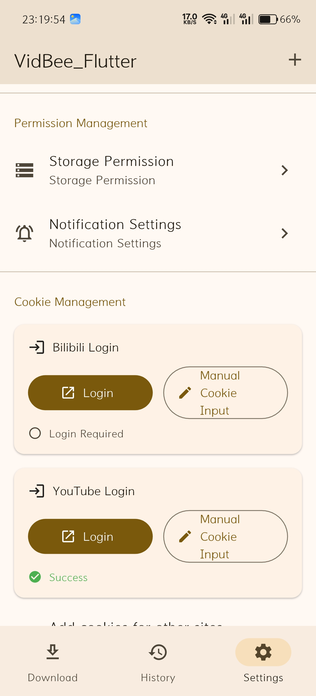
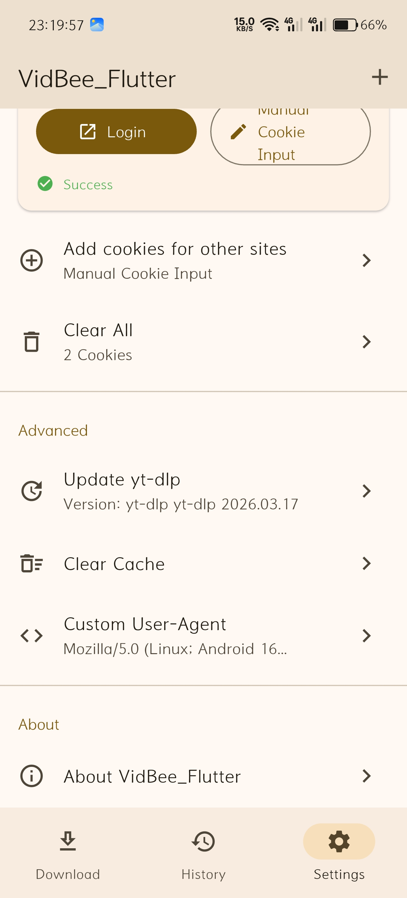

# VidBee_Flutter 🐝

  
  
  
  

**VidBee_Flutter** 是一款基于 Flutter 开发的现代化、跨平台视频下载器。它集成了强大的 [yt-dlp](https://github.com/yt-dlp/yt-dlp) 引擎，旨在为您提供最简单、流畅的视频与音频下载体验，支持全球 1000 多个主流视频平台。

---

### 📸 界面预览

| 链接解析 | 设置界面 (1) |
| :---: | :---: |
|  |  |

| 设置界面 (2) | 设置界面 (3) |
| :---: | :---: |
|  |  |

---

### ✨ 核心特性

- **🌍 强大的解析能力**：依托 `yt-dlp`，支持包括 YouTube, TikTok, Instagram, Twitter, Bilibili 在内的上千个站点。
- **🎨 纯净交互设计**：遵循 Material Design 3 规范，提供直观的状态追踪与队列管理。
- **🔐 一键平台登录**：内置 WebView 登录功能（针对 Bilibili, YouTube 等），轻松访问受限内容或高清流媒体。
- **⚙️ 全方位个性化**：
  - 自定义下载路径及多级音视频质量选择。
  - 支持 **深色/浅色/系统** 自适应主题。
  - 完善的多语言支持（中、英、日、韩）。
  - 专业级 **Cookie 导入** 与 **自定义 User-Agent** 配置。

---

### 📥 快速开始

1. **下载安装**：前往 [Latest Release](https://github.com/Autsunset/VidBee_Flutter/releases/latest) 下载最新的 APK 文件并安装到您的 Android 设备。
2. **复制链接**：在视频 App 中复制视频分享链接。
3. **开始下载**：打开 VidBee_Flutter，应用将自动识别剪贴板链接。点击解析并选择您需要的质量即可开始。

---

### 📖 高级指南

#### 🍪 如何导入 Cookie

某些限制级视频或高画质流需要 Cookie 才能访问。VidBee_Flutter 支持 **Netscape 格式** 的 Cookie 导入。

1. **安装插件**：在电脑浏览器（Chrome/Edge）安装 [Get cookies.txt LOCALLY](https://chrome.google.com/webstore/detail/get-cookiestxt-locally/ccmclabimipkeocclodkapndfdbobpph) 扩展。
2. **登录站点**：在浏览器中打开目标网站并登录账号。
3. **导出文件**：点击扩展图标，确认格式为 **Netscape**，点击 **Export** 下载 `cookies.txt`。
4. **导入应用**：将文件发送到手机，在 VidBee_Flutter 的 **设置 -> Cookie 管理** 中选择该文件。

> [!CAUTION]
> Cookie 包含您的敏感登录信息，**请勿将生成的 cookies.txt 文件分享给他人**。

#### ⚠️ 自定义 User-Agent 提示

对于 YouTube 等站点，使用默认 UA 可能导致解析失败。建议在设置中填入您当前设备的真实 User-Agent（可在浏览器搜索 "My User Agent" 获取）。

---

### 🛠️ 技术栈

*   **Framework**: [Flutter](https://flutter.dev/) (Channel Stable)
*   **Engine**: [yt-dlp](https://github.com/yt-dlp/yt-dlp) via [extractor](https://pub.dev/packages/extractor)
*   **State Management**: [Riverpod](https://riverpod.dev/)
*   **Database**: [Drift](https://drift.simonbinder.eu/) (SQLite)
*   **UI**: Material Design 3

---

### 🤝 参与开发

我们欢迎任何形式的贡献！如果您发现了 Bug 或有新的功能提议，请提交 [Issue](https://github.com/Autsunset/VidBee_Flutter/issues)。

### 📄 开源协议

本项目采用 [MIT License](LICENSE) 许可协议。

### 🙏 特别鸣谢

- [yt-dlp](https://github.com/yt-dlp/yt-dlp) - 强大的下载引擎
- [FFmpeg](https://ffmpeg.org/) - 多媒体处理基石
- [VidBee (Desktop)](https://github.com/nexmoe/VidBee) - 启发了本项目原型的优秀作品
